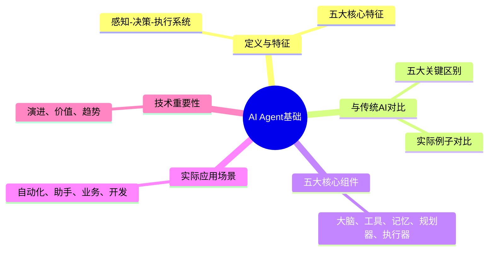

# 2026-02-26: AI Agent基础概念

## 🎯 今日学习目标
1. 理解AI Agent的基本定义和特征
2. 掌握Agent与传统AI系统的关键区别
3. 了解Agent的核心组件和工作原理

## 📚 学习内容

### 1. 什么是AI Agent？

**定义**：AI Agent（人工智能代理）是一个能够**感知环境、做出决策、执行行动**的智能系统。

**核心特征**：
- **自主性**：能够自主设定目标并采取行动
- **工具使用**：可以调用外部工具（搜索、计算、API等）
- **记忆能力**：能够记住之前的交互和结果
- **学习能力**：可以从经验中学习和改进
- **目标导向**：有明确的目标并追求达成

**简单比喻**：
- 传统AI = 聪明的百科全书（只能回答问题）
- AI Agent = 智能助手（不仅能回答问题，还能帮你做事）

### 2. Agent vs 传统AI系统

| 特性        | 传统AI系统 | AI Agent |
| --------- | ------ | -------- |
| **主动性**   | 被动响应   | 主动规划     |
| **工具使用**  | 无      | 可调用多种工具  |
| **记忆**    | 会话级别   | 长期记忆     |
| **目标导向**  | 无明确目标  | 有明确目标    |
| **多步骤执行** | 单次交互   | 多步骤复杂任务  |
| **学习改进**  | 有限     | 持续学习     |

**实际例子对比**：
- **传统AI**：问"明天北京天气如何？" → 回答"明天北京晴，15-25℃"
- **AI Agent**：说"帮我订一张明天去北京的机票" → 搜索航班、比较价格、填写信息、完成支付

### 3. Agent的核心组件

一个典型的Agent包含以下五大核心组件：

#### 1. 大脑（Brain/LLM）
- **作用**：大型语言模型，负责思考、推理、决策
- **示例**：GPT-4、Claude、Gemini等
- **功能**：理解任务、生成计划、做出判断

#### 2. 工具（Tools）
- **作用**：可调用的外部功能，扩展Agent能力
- **类型**：
  - 搜索工具（Google、Bing）
  - 计算工具（计算器、代码执行）
  - API工具（天气、股票、支付）
  - 文件工具（读写文件、处理文档）
- **重要性**：使Agent能够与真实世界交互

#### 3. 记忆（Memory）
- **作用**：存储和检索信息
- **类型**：
  - **短期记忆**：当前会话的上下文（通常有token限制）
  - **长期记忆**：向量数据库存储的历史经验和知识
  - **工作记忆**：当前任务相关的临时信息
- **价值**：使Agent能够持续学习和个性化

#### 4. 规划器（Planner）
- **作用**：分解复杂任务为可执行的步骤
- **功能**：
  - 任务分解：大任务 → 小步骤
  - 步骤排序：确定执行顺序
  - 资源分配：分配工具和资源
- **示例**：制定"写报告"的计划：收集资料 → 整理大纲 → 撰写内容 → 检查修改

#### 5. 执行器（Executor）
- **作用**：执行具体行动并处理结果
- **功能**：
  - 调用工具
  - 处理工具返回结果
  - 根据结果调整后续行动
  - 处理异常和错误

### 4. 为什么Agent如此重要？

**技术演进**：
1. **第一阶段**：规则系统（专家系统）
2. **第二阶段**：机器学习（预测模型）
3. **第三阶段**：大语言模型（生成内容）
4. **第四阶段**：AI Agent（执行任务）

**商业价值**：
- **自动化**：替代重复性人工工作
- **扩展性**：7x24小时不间断工作
- **一致性**：避免人为错误和情绪影响
- **可扩展**：通过工具不断扩展能力 
## 💡 学习要点总结

1. **Agent ≠ 聊天机器人**：Agent能做事，聊天机器人只能说话
2. **工具调用是关键**：没有工具调用，Agent就是"残疾"的
3. **记忆使Agent持续进化**：好的记忆系统是Agent学习的基础
4. **五大组件缺一不可**：大脑、工具、记忆、规划器、执行器共同工作

## 🔍 思考问题

1. 你能想到哪些实际场景适合使用Agent？
2. 如果没有工具调用，Agent的能力会受到什么限制？
3. 为什么记忆系统对Agent的长期表现很重要？

## 📖 延伸阅读（可选）

- [OpenAI Agents介绍](https://platform.openai.com/docs/guides/agents)
- [LangChain Agents概念](https://python.langchain.com/docs/modules/agents/)
- [AI Agent的发展趋势](https://arxiv.org/abs/2308.11432)

---

**学习建议**：
1. 先通读全文，理解基本概念
2. 重点理解"五大核心组件"
3. 思考实际应用场景
4. 记录不理解的地方

## 🗺️ 今日专业思维导图

我已经使用专业的Mermaid图表技能创建了今日思维导图。完整的思维导图请查看单独文件：
**`2026-02-26-思维导图.md`**

### 思维导图核心内容概览

### 思维导图学习价值

1. **可视化知识结构**：将抽象概念转化为图形化表示
2. **建立知识关联**：展示知识点之间的逻辑关系
3. **分层学习指导**：从整体到局部，从概念到细节
4. **记忆辅助工具**：通过图形结构增强记忆效果

### 如何使用思维导图学习

1. **先导图后细节**：先看思维导图了解知识框架，再学习详细内容
2. **主动构建**：学习后尝试自己绘制思维导图
3. **渐进整合**：将每日导图内容整合到总体知识体系中
4. **定期回顾**：用思维导图快速复习和巩固知识

**下一步**：学习后，请创建学习日记并回答自查题目，然后将今日思维导图内容整合到总体思维导图中。