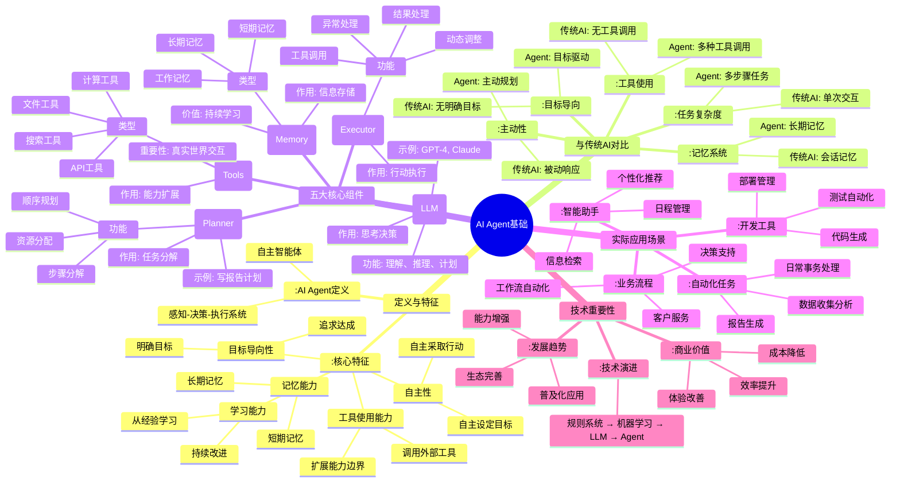

# 2026-02-26: AI Agent基础思维导图

## 🎯 今日学习目标
通过思维导图建立对AI Agent基础概念的体系化理解。

## 🗺️ 专业思维导图（Mermaid格式）

## 📊 思维导图解读指南

### 1. 结构层次
- **根节点**：AI Agent基础（中心主题）
- **一级分支**：定义、对比、组件、应用、重要性（5大模块）
- **二级分支**：每个模块的具体内容
- **三级分支**：详细知识点

### 2. 学习路径建议
1. **先看整体**：了解5大模块的结构
2. **分层学习**：从一级分支到三级分支
3. **重点突破**：关注核心组件和对比分析
4. **联系实际**：结合应用场景理解

### 3. 颜色编码说明
- **默认色**：基础概念
- **:::done**：已掌握内容（学习后标记）
- **:::important**：重点内容（需要重点理解）
- **:::example**：实际例子（帮助理解）

## 🔄 整合到总体思维导图

### 整合步骤
1. 打开总体思维导图：`思维导图-Agent工程师知识体系.md`
2. 找到"基础概念"部分
3. 将今日内容整合到相应位置：
   - AI Agent定义 → 基础概念/AI Agent定义
   - 与传统AI对比 → 基础概念/Agent vs 传统AI  
   - 五大核心组件 → 基础概念/Agent核心组件
4. 标记学习进度：在已完成部分打勾✅

### 整合后的效果
总体思维导图的"基础概念"部分将包含：
- ✅ AI Agent定义（已完成）
- 🔄 Agent vs 传统AI（进行中）
- 🔄 Agent核心组件（进行中）

## 📝 学习任务

### 今日学习任务
1. **学习理解**：通过思维导图掌握AI Agent基础概念
2. **对比分析**：理解Agent与传统AI的关键区别
3. **组件认知**：掌握五大核心组件的作用和关系
4. **应用思考**：基于导图思考实际应用场景

### 思维导图练习
1. **复述练习**：不看导图，尝试复述主要内容
2. **扩展思考**：在导图基础上添加自己的理解
3. **问题发现**：标记不理解或需要深入的部分

## 💡 学习技巧

### 思维导图学习法
1. **整体到局部**：先看整体结构，再学具体内容
2. **关联记忆**：通过图形结构建立知识点关联
3. **主动构建**：学习后尝试自己画思维导图
4. **定期回顾**：用思维导图快速复习

### 费曼学习法结合
1. **教学他人**：用思维导图向别人解释AI Agent
2. **简化表达**：用导图将复杂概念简单化
3. **发现漏洞**：在解释过程中发现理解不足
4. **回顾完善**：回到材料重新学习，完善导图

## 🎯 掌握程度自评

学习后，评估对每个部分的掌握程度：

- [ ] **定义与特征**: ⭐⭐⭐⭐⭐ (1-5星)
- [ ] **对比理解**: ⭐⭐⭐⭐⭐ (1-5星)
- [ ] **核心组件**: ⭐⭐⭐⭐⭐ (1-5星)
- [ ] **应用思考**: ⭐⭐⭐⭐⭐ (1-5星)
- [ ] **重要性认识**: ⭐⭐⭐⭐⭐ (1-5星)

## 🔗 相关资源

- [Mermaid Mindmap官方文档](https://mermaid.js.org/syntax/mindmap.html)
- [Obsidian Mermaid使用指南](https://help.obsidian.md/Editing+and+formatting/Mermaid)
- [AI Agent学习资源合集](待补充)

---

**提示**：Obsidian完美支持Mermaid图表，可以直接渲染查看思维导图。学习后记得：
1. 更新总体思维导图
2. 完成自查题目
3. 记录学习日记