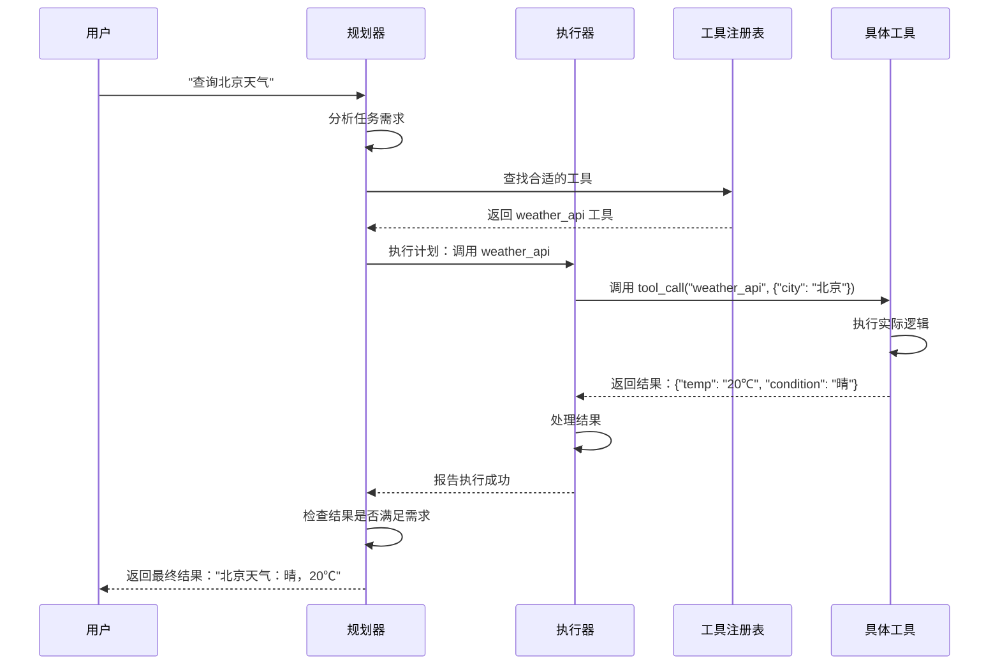

# 2026-02-27: 工具调用机制

## 🎯 今日学习目标
1. 理解工具调用在 Agent 系统中的重要性
2. 掌握工具调用的工作流程
3. 了解工具的定义、注册和调用方式
4. 学习工具调用的错误处理机制

## 📚 学习内容

### 1. 为什么工具调用如此重要？

**核心观点**：没有工具调用的 Agent 就像"没有手脚的大脑"

#### 传统 AI vs Agent 的能力对比

| 能力 | 传统 AI（无工具） | Agent（有工具） |
|------|------------------|----------------|
| **获取实时信息** | ❌ 只能依靠训练数据 | ✅ 可以搜索网络获取最新信息 |
| **执行实际操作** | ❌ 只能提供建议 | ✅ 可以实际订票、支付、发送邮件 |
| **处理私有数据** | ❌ 无法访问 | ✅ 可以读取本地文件、数据库 |
| **调用专业服务** | ❌ 无法使用 | ✅ 可以调用 API、微服务 |
| **持久化存储** | ❌ 会话结束即丢失 | ✅ 可以写入文件、数据库 |

**实际例子对比**：

**场景**：查询北京天气并发送给家人

**传统 AI（无工具）**：
```
用户：查询北京天气并发送给家人
AI：我无法查询实时天气，也无法发送消息。
     建议您访问 weather.com 查询，然后手动发送。
```

**Agent（有工具）**：
```
用户：查询北京天气并发送给家人
Agent 思考：
1. 调用天气 API 查询北京天气
2. 获取结果："北京晴，15-25℃"
3. 调用短信 API 发送给家人
4. 报告完成："已查询北京天气（晴，15-25℃）并发送给家人"
```

---

### 2. 工具调用的工作流程

#### 完整流程图



#### 六个关键步骤

**步骤 1：任务分析**
- 规划器分析用户需求
- 识别需要调用的工具类型
- 确定调用参数

**步骤 2：工具查找**
- 在工具注册表中搜索
- 匹配工具功能与任务需求
- 选择最合适的工具

**步骤 3：参数准备**
- 从用户输入提取参数
- 验证参数格式和有效性
- 填充必填参数

**步骤 4：工具调用**
- 执行器调用工具
- 传递必要参数
- 等待工具返回结果

**步骤 5：结果处理**
- 解析工具返回结果
- 检查是否成功
- 处理可能的错误

**步骤 6：反馈循环**
- 向规划器报告结果
- 规划器决定下一步行动
- 继续执行或调整计划

---

### 3. 工具的定义和注册

#### 工具的三要素

每个工具都包含三个核心要素：

**1. 工具名称（Name）**
- 唯一标识符
- 简洁明了
- 示例：`weather_api`, `file_reader`, `web_search`

**2. 工具描述（Description）**
- 说明工具的功能
- 描述适用场景
- 帮助规划器选择正确的工具
- 示例："查询指定城市的实时天气信息"

**3. 工具参数（Parameters）**
- 定义输入参数的格式
- 指定必填和选填参数
- 描述每个参数的含义
- 示例：
  ```json
  {
    "type": "object",
    "properties": {
      "city": {
        "type": "string",
        "description": "要查询的城市名称",
        "required": true
      },
      "unit": {
        "type": "string",
        "description": "温度单位：celsius 或 fahrenheit",
        "default": "celsius"
      }
    }
  }
  ```

#### 工具注册表示例

```python
# 工具注册表
tool_registry = {
    "weather_api": {
        "name": "weather_api",
        "description": "查询指定城市的实时天气信息",
        "function": get_weather,
        "parameters": {
            "city": {"type": "string", "required": True},
            "unit": {"type": "string", "default": "celsius"}
        }
    },
    
    "web_search": {
        "name": "web_search",
        "description": "在互联网上搜索信息",
        "function": search_web,
        "parameters": {
            "query": {"type": "string", "required": True},
            "num_results": {"type": "integer", "default": 10}
        }
    },
    
    "file_reader": {
        "name": "file_reader",
        "description": "读取本地文件内容",
        "function": read_file,
        "parameters": {
            "file_path": {"type": "string", "required": True},
            "encoding": {"type": "string", "default": "utf-8"}
        }
    },
    
    "code_executor": {
        "name": "code_executor",
        "description": "执行 Python 代码",
        "function": execute_code,
        "parameters": {
            "code": {"type": "string", "required": True},
            "timeout": {"type": "integer", "default": 30}
        }
    }
}
```

---

### 4. 工具调用的实现方式

#### 方式一：函数调用（Function Calling）

最直接的方式，工具就是 Python 函数：

```python
# 定义工具函数
def get_weather(city: str, unit: str = "celsius") -> dict:
    """查询天气"""
    # 调用天气 API
    response = requests.get(f"https://api.weather.com/{city}")
    data = response.json()
    
    # 格式化结果
    if unit == "fahrenheit":
        temp = data["temp_c"] * 9/5 + 32
        return {"temp": temp, "unit": "°F", "condition": data["condition"]}
    else:
        return {"temp": data["temp_c"], "unit": "°C", "condition": data["condition"]}

# 执行器调用工具
def execute_tool(tool_name: str, **kwargs):
    """执行工具调用"""
    if tool_name not in tool_registry:
        raise Exception(f"工具不存在：{tool_name}")
    
    tool = tool_registry[tool_name]
    return tool["function"](**kwargs)

# 实际调用
result = execute_tool("weather_api", city="北京", unit="celsius")
print(result)  # {"temp": 20, "unit": "°C", "condition": "晴"}
```

#### 方式二：API 调用

工具是外部 API 服务：

```python
def call_weather_api(city: str) -> dict:
    """调用外部天气 API"""
    import requests
    
    url = "https://api.openweathermap.org/data/2.5/weather"
    params = {
        "q": city,
        "appid": "YOUR_API_KEY",
        "units": "metric"
    }
    
    response = requests.get(url, params=params)
    
    if response.status_code == 200:
        data = response.json()
        return {
            "temp": data["main"]["temp"],
            "condition": data["weather"][0]["description"],
            "humidity": data["main"]["humidity"]
        }
    else:
        raise Exception(f"API 调用失败：{response.status_code}")
```

#### 方式三：命令行工具

工具是系统命令：

```python
import subprocess

def execute_command(command: str) -> str:
    """执行命令行工具"""
    try:
        result = subprocess.run(
            command,
            shell=True,
            capture_output=True,
            text=True,
            timeout=30
        )
        
        if result.returncode == 0:
            return result.stdout
        else:
            return f"错误：{result.stderr}"
    except subprocess.TimeoutExpired:
        return "错误：命令执行超时"
    except Exception as e:
        return f"错误：{str(e)}"

# 使用示例
output = execute_command("ls -la")
print(output)
```

---

### 5. 错误处理机制

#### 常见错误类型

**1. 工具不存在**
```python
# 错误：调用了不存在的工具
result = execute_tool("non_existent_tool", param="value")
# 处理：返回清晰的错误信息
# "错误：工具 'non_existent_tool' 不存在"
```

**2. 参数错误**
```python
# 错误：缺少必填参数
result = execute_tool("weather_api")  # 缺少 city 参数
# 处理：验证参数并提示
# "错误：缺少必填参数 'city'"
```

**3. 工具执行失败**
```python
# 错误：API 调用失败
result = execute_tool("weather_api", city="北京")
# API 返回 500 错误
# 处理：重试或返回备用方案
```

**4. 超时错误**
```python
# 错误：工具执行超时
result = execute_tool("code_executor", code="while True: pass")
# 处理：设置超时限制并终止
# "错误：工具执行超时（30 秒）"
```

#### 错误处理策略

```python
def execute_tool_with_retry(tool_name: str, max_retries: int = 3, **kwargs):
    """带重试机制的工具调用"""
    
    for attempt in range(max_retries):
        try:
            # 尝试执行
            result = execute_tool(tool_name, **kwargs)
            
            # 检查结果是否有效
            if is_valid_result(result):
                return {"status": "success", "result": result}
            else:
                raise Exception("结果无效")
                
        except Exception as e:
            # 记录错误
            error_msg = f"尝试 {attempt + 1}/{max_retries} 失败：{str(e)}"
            print(error_msg)
            
            # 最后一次尝试失败
            if attempt == max_retries - 1:
                return {
                    "status": "failed",
                    "error": str(e),
                    "suggestion": "尝试其他工具或方法"
                }
            
            # 等待后重试
            time.sleep(2 ** attempt)  # 指数退避
```

---

### 6. 实际应用示例

#### 示例 1：天气查询 Agent

```python
# 工具定义
tools = {
    "weather_api": {
        "description": "查询城市天气",
        "function": get_weather,
        "parameters": {"city": str}
    },
    "send_message": {
        "description": "发送消息给用户",
        "function": send_sms,
        "parameters": {"phone": str, "message": str}
    }
}

# Agent 执行流程
def weather_agent(user_request: str):
    # 用户："查询北京天气并发送给我"
    
    # 1. 规划器分析
    plan = [
        {"tool": "weather_api", "params": {"city": "北京"}},
        {"tool": "send_message", "params": {"phone": "123456789", "message": "待填充"}}
    ]
    
    # 2. 执行器执行
    weather_result = execute_tool("weather_api", city="北京")
    # 结果：{"temp": 20, "condition": "晴"}
    
    # 3. 构造消息
    message = f"北京天气：{weather_result['condition']}, {weather_result['temp']}°C"
    
    # 4. 发送消息
    execute_tool("send_message", phone="123456789", message=message)
    
    return "已查询并发送北京天气"
```

#### 示例 2：文件处理 Agent

```python
# 工具定义
tools = {
    "file_reader": read_file,
    "file_writer": write_file,
    "text_analyzer": analyze_text,
    "web_search": search_web
}

# Agent 执行流程
def research_agent(topic: str):
    # 用户："研究 AI Agent 技术并写一份报告"
    
    # 1. 搜索相关信息
    search_results = execute_tool("web_search", query="AI Agent 技术 2025")
    
    # 2. 保存搜索结果
    execute_tool("file_writer", 
                 file_path="research_notes.txt",
                 content=search_results)
    
    # 3. 读取并分析
    notes = execute_tool("file_reader", file_path="research_notes.txt")
    analysis = execute_tool("text_analyzer", text=notes)
    
    # 4. 撰写报告
    report = generate_report(analysis)
    execute_tool("file_writer",
                 file_path="AI_Agent_Report.md",
                 content=report)
    
    return "研究报告已生成：AI_Agent_Report.md"
```

---

## 💡 学习要点总结

### 核心概念
1. **工具调用是 Agent 的核心能力**：没有工具，Agent 就是"残疾"的
2. **工具三要素**：名称、描述、参数
3. **调用流程**：分析→查找→准备→调用→处理→反馈
4. **错误处理**：重试、降级、报告

### 关键理解
1. **规划器决定"用什么工具"**：基于工具描述选择
2. **执行器负责"怎么调用"**：处理实际调用逻辑
3. **工具注册表是"工具目录"**：所有可用工具的清单
4. **错误处理保证"可靠性"**：失败时优雅降级

### 实际应用
1. **API 调用**：天气、搜索、支付等外部服务
2. **文件操作**：读写本地文件
3. **代码执行**：运行 Python 代码
4. **系统命令**：执行 shell 命令

---

## 🔍 思考问题

1. 如果没有工具调用，Agent 能完成哪些任务？不能完成哪些任务？
2. 工具描述的重要性是什么？为什么规划器依赖工具描述？
3. 错误处理机制为什么重要？没有错误处理会怎样？
4. 你能想到哪些实际场景需要工具调用？

---

## 📖 延伸阅读

- [LangChain Tools 文档](https://python.langchain.com/docs/modules/agents/tools/)
- [OpenAI Function Calling](https://platform.openai.com/docs/guides/function-calling)
- [工具调用最佳实践](待补充)

---

**下一步**：
1. 查看思维导图建立知识体系
2. 回答自查题目巩固理解
3. 记录学习日记
4. 明日学习记忆系统
