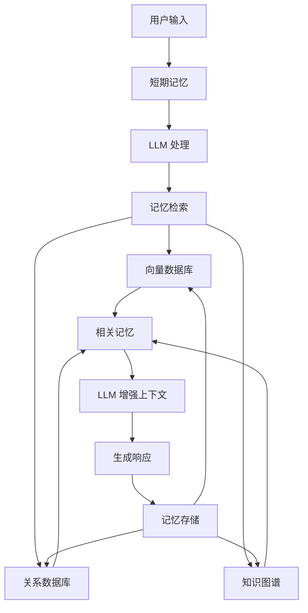

# 2026-02-28 记忆系统（Memory）

## 🎯 学习目标

**今日主题**：Agent 记忆系统（Memory System）
**学习时长**：2-3 小时
**掌握程度**：理解记忆系统原理，掌握核心概念，能设计简单记忆架构

**面试价值**：⭐⭐⭐⭐⭐（高频考点）

---

## 📚 为什么记忆系统重要？

### 没有记忆的 Agent = 金鱼

| 传统 AI | Agent 记忆系统 |
|---------|---------------|
| 每次对话都是新的 | 记住历史对话 |
| 无法学习用户偏好 | 了解用户习惯 |
| 重复回答相同问题 | 提供连贯体验 |
| 无法长期追踪任务 | 支持复杂任务 |

### 记忆系统的作用

1. **短期记忆**：当前对话上下文
2. **长期记忆**：用户偏好、历史记录、知识库
3. **工作记忆**：正在处理的任务信息
4. **知识记忆**：领域专业知识

---

## 🧠 记忆系统架构

### 1. 核心组件



### 2. 记忆类型对比

| 记忆类型     | 存储内容 | 存储方式 | 检索方式 | 使用场景  |
| -------- | ---- | ---- | ---- | ----- |
| **短期记忆** | 当前对话 | 内存   | 直接访问 | 上下文保持 |
| **长期记忆** | 历史对话 | 数据库  | 向量搜索 | 个性化回复 |
| **工作记忆** | 任务状态 | 内存   | 状态机  | 多步骤任务 |
| **知识记忆** | 领域知识 | 向量库  | 语义搜索 | 专业问答  |

---

## 🔍 关键技术

### 1. 向量数据库（Vector Database）

**核心概念**：将文本转换为向量（Embedding），通过向量相似度搜索

```python
# 简化示例：向量搜索原理
import numpy as np

# 1. 文本转换为向量
texts = ["用户喜欢咖啡", "用户讨厌绿茶", "用户常去星巴克"]
embeddings = [
    [0.1, 0.2, 0.3],  # 咖啡
    [0.9, 0.8, 0.7],  # 绿茶
    [0.2, 0.3, 0.4]   # 星巴克
]

# 2. 查询向量
query = "用户想喝什么？"
query_embedding = [0.15, 0.25, 0.35]

# 3. 计算相似度（余弦相似度）
def cosine_similarity(a, b):
    return np.dot(a, b) / (np.linalg.norm(a) * np.linalg.norm(b))

similarities = [cosine_similarity(query_embedding, emb) for emb in embeddings]
# 结果：[0.99, 0.85, 0.98] → 最相关：咖啡、星巴克
```

### 2. RAG（检索增强生成）

**核心思想**：先检索相关知识，再生成回答

```
用户问题 → 向量搜索 → 检索相关文档 → 增强上下文 → LLM 生成回答
```

**RAG 流程**：
1. **检索**：从知识库中查找相关文档
2. **增强**：将检索结果添加到提示中
3. **生成**：LLM 基于增强的上下文生成回答

### 3. Embedding 模型

**作用**：将文本转换为数值向量


## 🏗️ 记忆系统设计

### 1. 分层记忆架构

```python
class MemorySystem:
    def __init__(self):
        self.short_term = {}      # 短期记忆（对话上下文）
        self.long_term = VectorDB()  # 长期记忆（向量数据库）
        self.working_memory = {}  # 工作记忆（任务状态）
        self.knowledge_base = {}  # 知识记忆（领域知识）
    
    def store(self, content, memory_type="short_term"):
        """存储记忆"""
        if memory_type == "short_term":
            # 短期记忆：最近 N 轮对话
            self.short_term[timestamp] = content
            if len(self.short_term) > 10:  # 保持最近 10 轮
                self.short_term.pop(oldest_key)
                
        elif memory_type == "long_term":
            # 长期记忆：向量化存储
            embedding = get_embedding(content)
            self.long_term.store(embedding, content)
    
    def retrieve(self, query, memory_type="all"):
        """检索记忆"""
        if memory_type == "short_term":
            return list(self.short_term.values())[-5:]  # 最近 5 轮
        
        elif memory_type == "long_term":
            # 向量搜索相似记忆
            query_embedding = get_embedding(query)
            return self.long_term.search(query_embedding, top_k=3)
```

### 2. 记忆生命周期

```
1. 创建 → 2. 存储 → 3. 索引 → 4. 检索 → 5. 更新 → 6. 归档
```

**关键决策点**：
- **什么该记住**：用户偏好、重要决策、任务结果
- **什么该忘记**：无关细节、临时信息、错误信息
- **记忆时效性**：短期（小时）、中期（天）、长期（永久）

---

## 🔧 实战：构建简单记忆系统

### 场景：个性化咖啡推荐 Agent

```python
import chromadb
from sentence_transformers import SentenceTransformer

class CoffeeAgentMemory:
    def __init__(self):
        # 初始化向量数据库
        self.client = chromadb.Client()
        self.collection = self.client.create_collection("coffee_preferences")
        
        # 初始化 Embedding 模型
        self.embedder = SentenceTransformer('all-MiniLM-L6-v2')
        
        # 短期记忆
        self.conversation_history = []
    
    def remember_preference(self, user_id, preference):
        """记住用户偏好"""
        # 生成向量
        embedding = self.embedder.encode(preference).tolist()
        
        # 存储到向量数据库
        self.collection.add(
            embeddings=[embedding],
            documents=[preference],
            metadatas=[{"user_id": user_id, "type": "preference"}],
            ids=[f"pref_{user_id}_{timestamp}"]
        )
    
    def recall_preferences(self, user_id, query):
        """回忆用户偏好"""
        # 查询向量
        query_embedding = self.embedder.encode(query).tolist()
        
        # 搜索相似记忆
        results = self.collection.query(
            query_embeddings=[query_embedding],
            n_results=3,
            where={"user_id": user_id}
        )
        
        return results['documents'][0] if results['documents'] else []
    
    def update_conversation(self, user_message, agent_response):
        """更新对话历史（短期记忆）"""
        self.conversation_history.append({
            "user": user_message,
            "agent": agent_response,
            "timestamp": get_current_time()
        })
        
        # 保持最近 10 轮对话
        if len(self.conversation_history) > 10:
            self.conversation_history = self.conversation_history[-10:]
```

### 使用示例

```python
# 初始化记忆系统
memory = CoffeeAgentMemory()

# 用户表达偏好
memory.remember_preference(
    user_id="user123",
    preference="我喜欢拿铁咖啡，加燕麦奶，少糖"
)

# 几天后用户回来
memory.remember_preference(
    user_id="user123", 
    preference="我不喜欢太苦的咖啡，偏好中度烘焙"
)

# 当用户问"推荐什么咖啡？"时
preferences = memory.recall_preferences(
    user_id="user123",
    query="推荐咖啡"
)
# 返回：["我喜欢拿铁咖啡，加燕麦奶，少糖", "我不喜欢太苦的咖啡，偏好中度烘焙"]

# LLM 基于记忆生成个性化推荐
context = f"用户偏好：{', '.join(preferences)}"
recommendation = llm.generate(f"基于用户偏好推荐咖啡：{context}")
# 输出："根据您的偏好，推荐燕麦拿铁，中度烘焙，少糖"
```

---

## ⚠️ 挑战与解决方案

### 挑战 1：记忆冲突
**问题**：用户说"我喜欢咖啡"，又说"我讨厌咖啡"
**解决**：
- 时间戳加权：最近的说法权重更高
- 上下文区分：不同场景下的偏好可能不同
- 置信度评分：根据表达强度调整权重

### 挑战 2：记忆膨胀
**问题**：记忆太多，检索变慢
**解决**：
- 记忆压缩：相似记忆合并
- 重要性评分：重要记忆优先保留
- 定期清理：删除过时记忆

### 挑战 3：隐私安全
**问题**：用户隐私数据存储
**解决**：
- 数据脱敏：移除敏感信息
- 本地存储：敏感数据不上传云端
- 用户控制：允许用户删除记忆

---

## 📊 面试常见问题

### 1. 基础概念
- Q：解释短期记忆和长期记忆的区别？
- Q：什么是向量数据库？为什么 Agent 需要它？
- Q：RAG 的工作原理是什么？

### 2. 设计问题
- Q：设计一个支持 100 万用户的记忆系统？
- Q：如何解决记忆冲突问题？
- Q：如何设计记忆的检索和更新机制？

### 3. 实践问题
- Q：用代码实现一个简单的记忆存储和检索？
- Q：如何评估记忆系统的效果？
- Q：记忆系统如何与工具调用结合？

---

## 🎯 关键要点总结

### 必须掌握的 5 个概念
1. **向量化**：文本 → 向量，实现语义搜索
2. **相似度计算**：余弦相似度、欧氏距离
3. **RAG 流程**：检索 → 增强 → 生成
4. **记忆分层**：短期、长期、工作、知识记忆
5. **记忆生命周期**：创建、存储、检索、更新、归档

### 必须理解的 3 个关系
1. **记忆与上下文**：记忆提供上下文，上下文影响记忆检索
2. **记忆与个性化**：记忆实现个性化，个性化提升用户体验
3. **记忆与效率**：好的记忆系统减少重复工作，提升效率

---

## 📝 学习任务

### 1. 理解任务（30 分钟）
- 阅读本文，理解核心概念
- 画出记忆系统架构图
- 总结向量数据库的作用

### 2. 思考任务（30 分钟）
- 思考：如果没有记忆系统，Agent 会有什么限制？
- 设计：为一个电商客服 Agent 设计记忆系统
- 对比：传统数据库 vs 向量数据库的适用场景

### 3. 实践任务（60 分钟）
- 尝试用 Python 实现简单的向量相似度计算
- 设计一个记忆存储和检索的伪代码
- 思考如何将记忆系统集成到之前学的工具调用中

---

## 🔗 扩展学习

### 推荐阅读
1. **论文**：《Retrieval-Augmented Generation for Knowledge-Intensive NLP Tasks》
2. **工具**：ChromaDB、Pinecone、Weaviate 官方文档
3. **框架**：LangChain Memory 模块

### 下一步学习
- **Day 4**：ReAct 论文精读（思考-行动循环）
- **Day 5**：LangChain 实战（集成记忆系统）
- **Day 6**：多 Agent 系统（记忆共享与同步）

---

## 💡 费曼学习法应用

### 简单解释（尝试用一句话解释）
"记忆系统让 Agent 记住过去的事情，从而提供更连贯、个性化的服务。"

### 发现漏洞（检查理解盲点）
- 向量数据库具体如何工作？
- 记忆检索的准确率如何保证？
- 记忆冲突时如何处理？

### 填补漏洞（深入学习）
- 学习 Embedding 模型原理
- 研究相似度算法优化
- 了解记忆融合策略

### 完善解释（用类比解释）
"记忆系统就像人的大脑：
- 短期记忆 = 工作台（当前任务）
- 长期记忆 = 书架（存储知识）
- 向量搜索 = 大脑联想（相关记忆）
- RAG = 查资料再回答（检索增强）"

---

**学习愉快！完成后记得做自查题目和记录学习日记！** 🚀