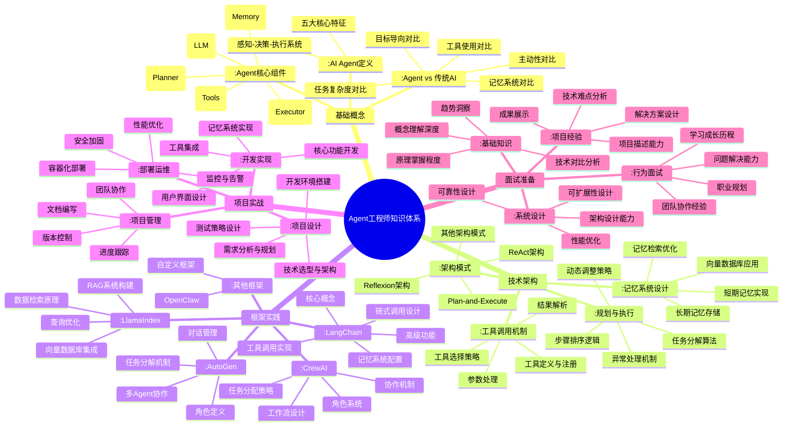

# Agent工程师知识体系思维导图

## 🗺️ 总体知识地图（Mermaid专业版）



## 📅 学习进度跟踪

### 学习阶段规划
- **第1周**：基础概念 ✅ 进行中
- **第2周**：技术架构 🔄 待开始
- **第3-4周**：框架实践 🔄 待开始
- **第5-6周**：项目实战 🔄 待开始
- **第7-8周**：面试准备 🔄 待开始

### 当前进度详情
```
基础概念 (25%)
├── AI Agent定义 ✅ 已完成
├── Agent vs 传统AI 🔄 进行中
└── Agent核心组件 🔄 进行中

技术架构 (0%)
├── 架构模式 🔄 未开始
├── 工具调用机制 🔄 未开始
├── 记忆系统设计 🔄 未开始
└── 规划与执行 🔄 未开始

框架实践 (0%)
├── LangChain 🔄 未开始
├── LlamaIndex 🔄 未开始
├── AutoGen 🔄 未开始
└── CrewAI 🔄 未开始
```

## 🔄 思维导图更新系统

### 更新规则
1. **每日更新**：学习后更新对应分支内容
2. **进度标记**：
   - ✅ 已完成
   - 🔄 进行中  
   - ⏳ 待开始
   - 🎯 重点内容
3. **颜色编码**：
   - 绿色：已掌握
   - 黄色：学习中
   - 红色：未开始
   - 蓝色：重点内容

### 更新流程
1. 学习当日内容
2. 在总体导图中找到对应分支
3. 更新分支内容（添加细节、示例、理解）
4. 标记学习进度
5. 添加学习日期标记

### 今日更新任务（2026-02-26）
1. **基础概念/AI Agent定义**：添加今日学习内容
2. **基础概念/Agent vs 传统AI**：开始学习
3. **基础概念/Agent核心组件**：开始学习

## 💡 思维导图使用指南

### 学习阶段使用
1. **预习阶段**：看总体结构，了解知识体系
2. **学习阶段**：聚焦当前分支，深入理解
3. **复习阶段**：回顾已学分支，巩固记忆
4. **整合阶段**：建立知识点之间的关联

### 知识管理功能
1. **进度可视化**：清晰看到学习进度
2. **重点标记**：标识需要重点掌握的内容
3. **关联发现**：发现不同知识点之间的联系
4. **知识检索**：快速定位特定知识点

### 面试准备应用
1. **知识梳理**：系统化整理面试知识点
2. **弱点识别**：发现知识薄弱环节
3. **快速复习**：考前快速回顾知识体系
4. **问题预测**：基于知识体系预测面试问题

## 🎯 学习目标管理

### 短期目标（1-2周）
- [ ] 掌握基础概念体系
- [ ] 理解技术架构原理
- [ ] 完成第一个小项目

### 中期目标（3-6周）
- [ ] 熟练使用主流框架
- [ ] 完成完整项目实战
- [ ] 建立项目作品集

### 长期目标（7-8周）
- [ ] 通过模拟面试
- [ ] 准备面试材料
- [ ] 达到求职要求水平

## 📊 学习效果评估

### 评估维度
1. **概念理解**：能否准确解释核心概念
2. **技术掌握**：能否应用技术解决问题
3. **项目能力**：能否完成实际项目开发
4. **面试准备**：能否应对面试考察

### 评估方法
1. **自查题目**：通过题库自查评估理解
2. **项目实践**：通过项目完成评估能力
3. **模拟面试**：通过模拟评估面试准备
4. **知识复述**：通过讲解评估掌握程度

## 🔗 相关资源

### 学习资源
- 每日学习资源：`1.学习资源/`目录
- 学习日记：`2.学习日记/`目录
- 自查题目：`3.题库自查/`目录

### 工具资源
- [Mermaid官方文档](https://mermaid.js.org/)
- [Obsidian Mermaid插件](https://github.com/hipstersmoothie/obsidian-plugin-mermaid)
- [思维导图学习法指南](待补充)

### 社区资源
- [LangChain中文社区](https://www.langchain.com.cn/)
- [AI Agent技术论坛](待补充)
- [GitHub相关项目](待补充)

---

**重要提示**：
1. 此思维导图为动态文档，随学习进度不断更新
2. 每日学习后务必更新对应部分
3. 使用颜色和标记跟踪学习状态
4. 定期回顾和优化思维导图结构

**今日任务**：开始学习基础概念，更新AI Agent定义部分！