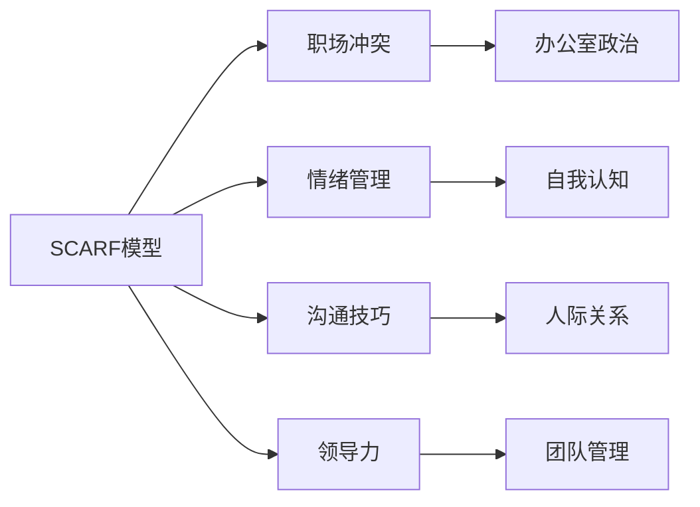
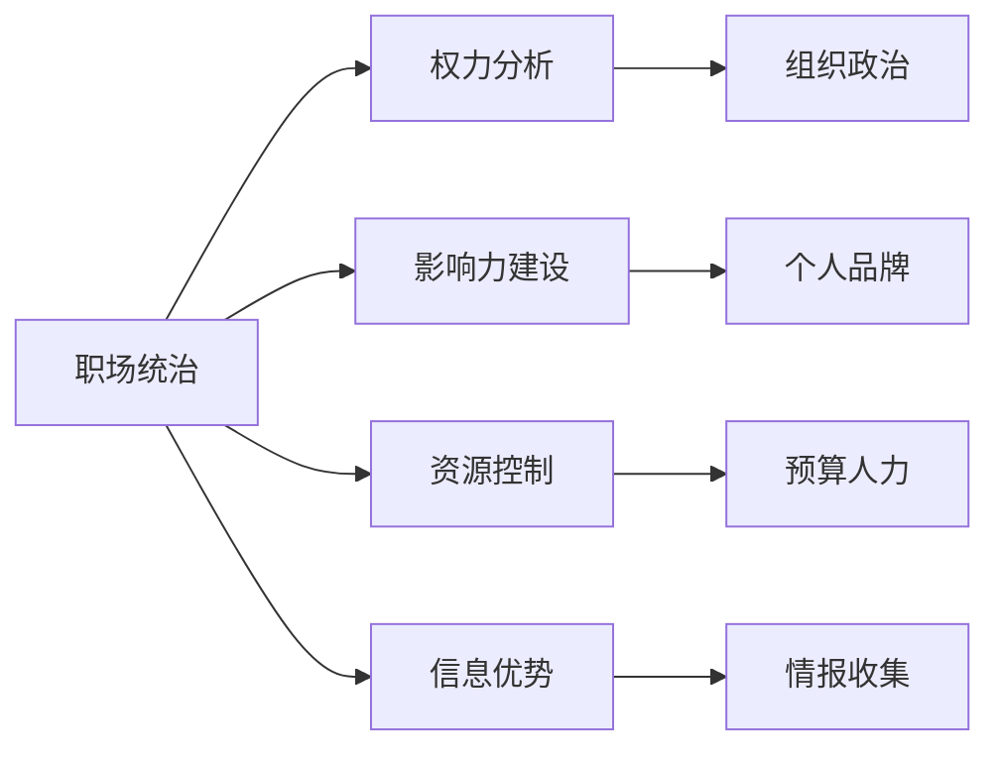

# 对话主题索引

> 按主题分类的对话记录索引，便于按话题检索和分析模式。

## 🏷️ 主题分类体系

### 1. 职场发展
- **晋升策略**: 升职、加薪、职级评定
- **技能提升**: 学习、培训、能力建设
- **职业规划**: 方向选择、转型、长期目标
- **办公室政治**: 权力斗争、联盟、竞争

### 2. 人际关系
- **上下级关系**: 领导管理、下属指导
- **同事协作**: 团队合作、跨部门沟通
- **冲突处理**: 矛盾解决、谈判、妥协
- **网络建设**: 人脉拓展、关系维护

### 3. 项目管理
- **任务分配**: 工作安排、优先级
- **进度跟踪**: 汇报、检查、调整
- **风险管理**: 问题预防、危机处理
- **成果交付**: 验收、评价、复盘

### 4. 个人成长
- **认知训练**: 思维模式、决策能力
- **情绪管理**: 压力应对、情绪调节
- **习惯养成**: 自律、效率、健康
- **价值观**: 原则、底线、人生哲学

### 5. 技术讨论
- **架构设计**: 技术选型、系统规划
- **问题解决**: 故障排查、性能优化
- **创新探索**: 新技术、新方法
- **知识分享**: 培训、文档、交流

## 📊 主题热度统计

### 高频主题 (最近30天)
| 主题 | 出现次数 | 重要性 | 关联人物 |
|------|----------|--------|----------|
| SCARF模型 | 3 | 高 | 自我对话 |
| 职场统治 | 2 | 高 | 自我对话 |
| 技术碾压 | 1 | 中 | 未命名领导 |
| 认知偏差 | 1 | 中 | 自我对话 |

### 主题演进趋势
```时间线
时间        主题          状态        关键进展
---------   -----------   ----------  --------------------------
2026-04-10  SCARF模型     学习阶段     理解基础概念
2026-04-11  SCARF模型     应用阶段     分析实际场景
2026-04-13  SCARF模型     深化阶段     加入知识盲区
2026-04-13  职场统治      探索阶段     设计统治策略
2026-04-13  技术碾压      执行阶段     实际案例应对
```

## 🔗 主题关联网络

### SCARF模型关联主题


### 职场统治关联主题


## 📝 主题详情页模板

### [[{{主题名}}]]
**定义**: {{主题的简要定义}}

**重要性**: {{高/中/低}} - {{原因}}

**学习状态**:
- [ ] 概念理解
- [ ] 方法掌握  
- [ ] 实践应用
- [ ] 教学输出

**核心知识点**:
1. {{知识点1}}
2. {{知识点2}}
3. {{知识点3}}

**应用场景**:
- 场景1: {{描述}}
- 场景2: {{描述}}
- 场景3: {{描述}}

**常见误区**:
- {{误区1}}
- {{误区2}}

**进阶方向**:
- {{方向1}}
- {{方向2}}

**关联对话记录**:
- [[YYYY-MM-DD-对话1]]
- [[YYYY-MM-DD-对话2]]

**学习资源**:
- [ ] {{资源1}}
- [ ] {{资源2}}

**实践计划**:
- 短期: {{1周内}}
- 中期: {{1月内}}
- 长期: {{3月内}}

## 🎯 当前重点主题

### [[SCARF模型]]
**状态**: 深化学习阶段
**下一步**: 创建认知卡片 + 更多场景分析
**目标**: 成为直觉反应工具

### [[职场统治]]
**状态**: 策略设计阶段  
**下一步**: 选择具体统治领域并突破
**目标**: 3个月内建立不可替代性

### [[技术领导力]]
**状态**: 需求识别阶段
**下一步**: 分析AI时代的技术领导力要素
**目标**: 定义个人技术领导风格

## 🔍 检索指南

### 按场景检索
```
#场景/会议
#场景/一对一
#场景/冲突
#场景/谈判
```

### 按目的检索
```
#目的/学习
#目的/决策
#目的/影响
#目的/解决
```

### 按结果检索
```
#结果/成功
#结果/失败  
#结果/待定
#结果/教训
```

### 按情绪检索
```
#情绪/愤怒
#情绪/愉悦
#情绪/焦虑
#情绪/自信
```

## 📈 分析工具

### 对话模式分析
```分析模板
主题: {{主题}}
模式识别: {{重复出现的对话模式}}
成功因素: {{导致好结果的因素}}
失败因素: {{导致坏结果的因素}}
改进建议: {{如何做得更好}}
```

### 学习进度追踪
```进度模板
主题: {{主题}}
开始时间: {{日期}}
当前阶段: {{阶段}}
掌握程度: {{1-10分}}
实践次数: {{次数}}
教学次数: {{次数}}
下一步: {{具体行动}}
```

---
**最后更新**: 2026-04-13
**总主题数**: 5
**活跃主题**: 3
**重点关注**: 2
```