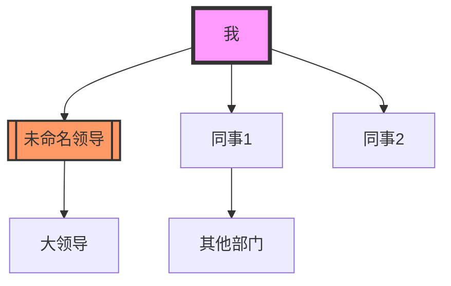

# 人物关系索引

> 本文件记录所有重要人物的信息、关系网络和互动历史。
> 使用双向链接 [[人物名]] 连接到具体对话记录。

## 📊 索引说明
- **更新频率**: 每次重要对话后更新
- **使用方式**: 通过 `[[人物名]]` 链接到具体对话
- **AI友好**: 结构化数据便于AI分析关系网络

## 👥 人物列表

### 工作关系
#### 领导层
```人物卡片
姓名: [[未命名领导]]
角色: 技术领导/直接上级
关系: 上下级 (紧张)
信任度: 3/10
合作意愿: 2/10
关键事件:
- 2026-04-13: 分配MySQL转PgSQL任务 (预计1月，实际几小时完成)
- SCARF分析: 地位威胁、公平性威胁、关联性威胁
最近互动: 2026-04-13
状态: 需谨慎应对
```

#### 同事层
```人物卡片
姓名: 
角色: 
关系: 
信任度: 
合作意愿: 
关键事件:
- 
最近互动: 
状态: 
```

#### 下属层
```人物卡片
姓名: 
角色: 
关系: 
信任度: 
合作意愿: 
关键事件:
- 
最近互动: 
状态: 
```

### 个人关系
#### 家人
```人物卡片
姓名: 
角色: 
关系: 
信任度: 
合作意愿: 
关键事件:
- 
最近互动: 
状态: 
```

#### 朋友
```人物卡片
姓名: 
角色: 
关系: 
信任度: 
合作意愿: 
关键事件:
- 
最近互动: 
状态: 
```

#### 导师/顾问
```人物卡片
姓名: 
角色: 
关系: 
信任度: 
合作意愿: 
关键事件:
- 
最近互动: 
状态: 
```

## 🔗 关系网络图


## 📈 关系变化追踪

### 信任度变化趋势
```时间线
时间        人物          信任度  事件
---------   -----------   ------  --------------------------
2026-04-13  未命名领导     3/10    分配打压性任务
```

### 合作质量评估
| 人物 | 沟通效率 | 信息透明度 | 支持程度 | 总体评分 |
|------|----------|------------|----------|----------|
| 未命名领导 | 低 | 低 | 低 | ⭐☆☆☆☆ |

## 🎯 关系管理策略

### [[未命名领导]]
**当前策略**: 技术碾压 + 优雅离场准备
**短期目标**: 建立不可替代性
**中期目标**: 获得更高层认可
**长期目标**: 超越其职业发展

**行动项**:
- [ ] 找到其技术盲区并建立优势
- [ ] 建立跨部门影响力
- [ ] 准备市场价值证明 (拿offer)
- [ ] 设计优雅离场方案

### 通用关系建设原则
1. **信息优势**: 知道对方不知道的
2. **价值交换**: 我能提供什么独特价值
3. **信任积累**: 小承诺必兑现
4. **网络效应**: 通过A认识B认识C

## 📝 记录规范
1. **命名**: `YYYY-MM-DD-人物-主题.md`
2. **标签**: 必含 `对话记录`、`人物:XXX`、`主题:XXX`
3. **摘要**: 前200字必须包含核心要点
4. **链接**: 必须链接到相关人物和主题
5. **更新**: 重要进展后更新人物卡片

## 🔍 快速检索
- `#人物/领导` - 所有领导相关对话
- `#人物/同事` - 同事相关对话  
- `#主题/冲突` - 冲突处理对话
- `#主题/合作` - 合作协商对话
- `#情绪/愤怒` - 引发愤怒的对话
- `#情绪/愉悦` - 愉悦的对话

---
**最后更新**: 2026-04-13
**总人物数**: 1
**活跃关系**: 1
**需关注关系**: 1
```