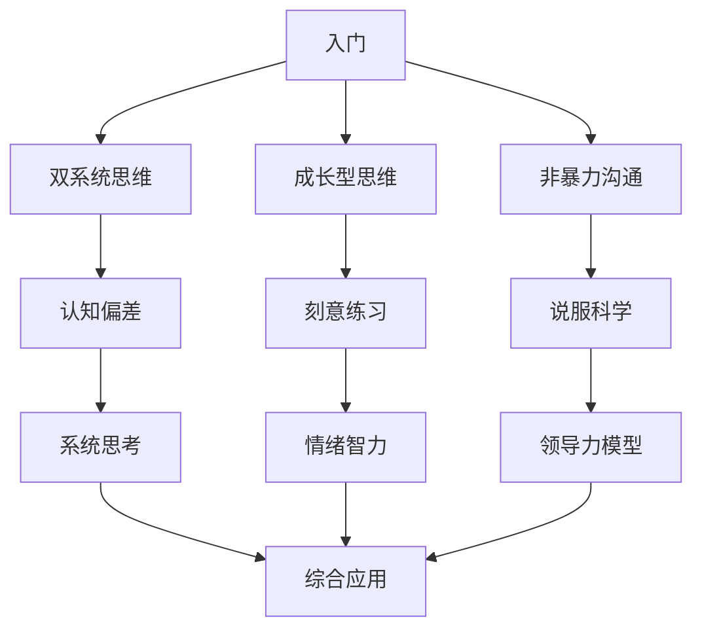

# 认知工具箱总览

> 系统化的认知与行为科学模型集合，用于理解自己、影响他人、做出更好决策。

## 📊 工具箱结构

```
05-认知工具箱/
├── 00-工具箱总览.md          ← 你在这里
├── 01-决策与判断/
├── 02-沟通与影响力/
├── 03-学习与成长/
├── 04-情绪与动机/
├── 05-系统与战略/
├── 06-职场与组织/
└── 07-综合应用案例/
```

## 🎯 使用指南

### **选择工具的原则**
1. **问题匹配**: 什么工具解决什么问题
2. **熟练度**: 先精通1-2个，再扩展
3. **组合使用**: 多个工具联合应用效果更好

### **学习路径建议**


## 🔧 工具箱分类

### 1. 决策与判断类
**解决**: 如何做出更好的选择
**核心工具**: [[双系统思维]]、[[认知偏差]]、[[前景理论]]

### 2. 沟通与影响力类  
**解决**: 如何有效沟通和影响他人
**核心工具**: [[说服科学]]、[[非暴力沟通]]、[[沟通风格分析]]

### 3. 学习与成长类
**解决**: 如何高效学习和持续成长
**核心工具**: [[成长型思维]]、[[刻意练习]]、[[学习金字塔]]

### 4. 情绪与动机类
**解决**: 如何管理情绪和保持动力
**核心工具**: [[情绪智力]]、[[自我决定理论]]、[[SCARF模型]]

### 5. 系统与战略类
**解决**: 如何看到整体和制定战略
**核心工具**: [[系统思考]]、[[第一性原理]]、[[奥卡姆剃刀]]

### 6. 职场与组织类
**解决**: 如何在职场和组织中成功
**核心工具**: [[领导力模型]]、[[团队发展阶段]]、[[心理安全]]

## 📈 工具熟练度追踪

| 工具 | 了解程度 | 应用频率 | 掌握程度 | 下次复习 |
|------|----------|----------|----------|----------|
| [[SCARF模型]] | 深入 | 高 | 8/10 | 2026-04-20 |
| [[双系统思维]] | 基础 | 中 | 5/10 | 2026-04-15 |
| [[成长型思维]] | 基础 | 中 | 5/10 | 2026-04-15 |
| [[非暴力沟通]] | 了解 | 低 | 3/10 | 2026-04-17 |
| [[说服科学]] | 了解 | 低 | 3/10 | 2026-04-17 |

## 🎯 当前重点工具

### **优先级1: SCARF模型**
- **状态**: 深入学习中
- **目标**: 成为直觉反应
- **应用计划**: 每天分析1个社交场景

### **优先级2: 双系统思维**
- **状态**: 需要加强
- **目标**: 识别思考模式
- **应用计划**: 重要决策前刻意调用系统2

### **优先级3: 成长型思维**
- **状态**: 基础了解
- **目标**: 改变能力认知
- **应用计划**: 转换3个固定思维表述

## 💡 工具组合应用

### **场景1: 职场冲突**
```
工具组合: SCARF + 非暴力沟通 + 情绪智力
步骤:
1. SCARF分析: 哪个需求被威胁?
2. 情绪智力: 识别自己和他人的情绪
3. 非暴力沟通: 表达观察、感受、需求、请求
```

### **场景2: 重要决策**
```
工具组合: 双系统思维 + 认知偏差 + 前景理论
步骤:
1. 双系统思维: 这是系统1直觉还是系统2分析?
2. 认知偏差: 我可能受到哪些偏差影响?
3. 前景理论: 我是否过度损失厌恶?
```

### **场景3: 学习新技能**
```
工具组合: 成长型思维 + 刻意练习 + 学习金字塔
步骤:
1. 成长型思维: "我能通过努力学会"
2. 刻意练习: 设计明确目标、专注、反馈
3. 学习金字塔: 选择主动学习方式
```

## 🔄 工具箱更新机制

### **每周检查**
1. **工具使用情况**: 哪些工具用了？效果如何？
2. **新工具学习**: 是否需要学习新工具？
3. **熟练度更新**: 更新掌握程度评分

### **每月回顾**
1. **工具组合优化**: 哪些组合效果最好？
2. **应用场景扩展**: 在新场景中应用工具
3. **教学输出**: 能否向他人解释某个工具？

### **季度升级**
1. **工具淘汰**: 哪些工具不再有用？
2. **新领域探索**: 需要哪些新类型的工具？
3. **个性化调整**: 根据个人特点调整工具集

## 📝 记录规范

### **工具卡片模板**
每个工具应有：
1. **核心定义**: 一句话说明
2. **关键要点**: 3-5个核心点
3. **应用场景**: 何时使用
4. **使用步骤**: 具体操作指南
5. **常见误区**: 避免错误使用
6. **关联工具**: 与哪些工具组合使用

### **应用记录模板**
每次使用工具应记录：
1. **场景描述**: 什么情况？
2. **使用工具**: 用了哪个工具？
3. **使用过程**: 具体怎么用的？
4. **效果评估**: 效果如何？
5. **改进想法**: 下次如何改进？

## 🚀 立即行动

### **本周任务**
1. [ ] 创建[[双系统思维]]工具卡片
2. [ ] 创建[[成长型思维]]工具卡片  
3. [ ] 在3个场景中应用SCARF模型
4. [ ] 更新工具熟练度追踪表

### **本月目标**
1. 掌握3个核心工具到熟练程度
2. 建立工具组合应用习惯
3. 开始工具教学输出（写文章/分享）

### **季度愿景**
1. 建立个人化的认知工具箱
2. 工具应用成为直觉反应
3. 能够指导他人使用工具

---
**创建时间**: 2026-04-13
**最后更新**: 2026-04-13
**工具总数**: 6类18个工具
**掌握目标**: 3个月内掌握10个核心工具
```